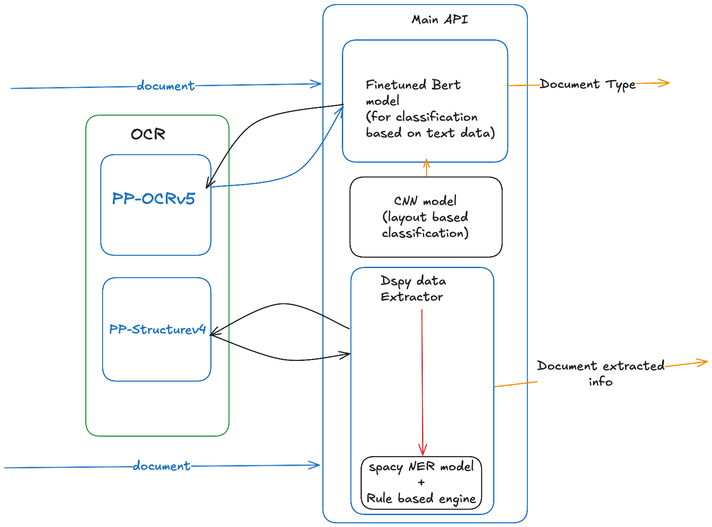

# Welcome to the Central API for document classification and extraction application

## Pre-Requisities
- install uv -> pip install uv 
- uv will manage the dependancies and virtual environment
- BasedPyright is used as type checker
- [install ollama for local model](https://ollama.com)
- [install qwen3:4b model](https://ollama.com/library/qwen3:4b)
- 4B parameter Qwen3 model is used from ollama in this API and in my testing it performed significantly accurately
- If you want to swap to any other model, setup .env and update variables. (check .env.local)
    ```bash
    MODEL_NAME=
    MODEL_URL=
    MODEL_API_KEY=
    MODEL_PROVIDER=
    ```
    - for model name use the litellm format. <provider_name>/<model_name> ex.- ollama_chat/qwen3:4b
    - by defaut this will point to ollama model

- [huggingface cli installation](https://huggingface.co/docs/huggingface_hub/main/en/guides/cli)

## Core Components
### Document Classifier
- finetuned Bert based uncased model for classify documents. you can check [My finetuned BERT model](https://huggingface.co/visithck/Bert-Based-Docu-classify) submitted in huggingface hub.
- Model developed using transformers.
- CNN model finetuned for document classification based on document structure. (Did not include in application since the CNN model was a file of size 1GB and provided less than 65% accuracy)
- Model developed using keras
- This is trained with augmented data to account for any human/camera error in pictures (alignment, color saturation, warping)

### Document Extraction
- SLM model qwen3:4b used for document extraction. 
- Document extraction pipeline built using dspy.
- slm model show very low failure rate (<2%), however dspy allows to build model agnostic llm systems. hence performance should remain same or better with equal or better models.
- SLM showcased latency of ~2min of macbook m2. and few seconds on Google colab.
- recommended to host SLM on GPU
- For using smaller/weaker models recommended to use MIPROv2 for few shot prompt tuning.
- As a fallback uses spacy and regex rule based parser.
- During testing it was deemed spacy NER tagging was deemed unecessary since SLM alone showcased incredible results.
- Check experiments folder for jupyter notebooks if you need to check ollama + spacy model. 

> [!NOTE]
> Document extraction models should run asynchronously as a background task

## Architecture



## steps to setup Main API service
- install uv
- install dependacy and models
```bash
uv run app.py
```
- run fastapi application
```bash
uv run fastapi run app:app --host 0.0.0.0 --port 3000
```
*This will start a fastapi server in port 3000*

> [!NOTE]
> BasedPyright is used for python type checking 

> [!TIP]
> for swagger docs goto http://127.0.0.1:3000/docs 