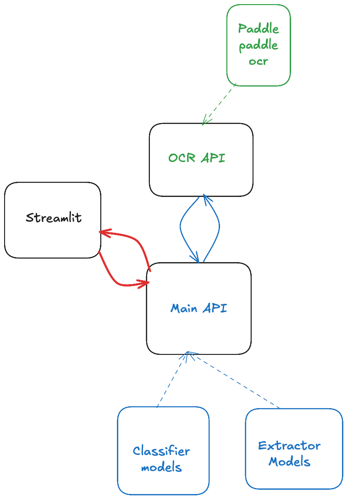

# Welcome to the Frontend for document classification and extraction application

## Pre-Requisities
- install uv -> pip install uv 
- uv will manage the dependancies and virtual environment
- BasedPyright is used as type checker


## Core Components
### Document Upload
- Document upload option allows to upload document and png/jpeg/jpg

### Polling and render extracted details
- using streamlit fragments a UI component that polls endpoint every 5s and will render until 200 OK is received
- final extraction viewed as editable json.


> [!NOTE]
> Both process will take significant amount of time in local environment.


## steps to setup Main API service
- install uv
- install dependacy and models
```bash
uv run streamlit run app.py  
```

*This will start a streamlit frontend in port 8501*

> [!NOTE]
> BasedPyright is used for python type checking 

## Architecture

